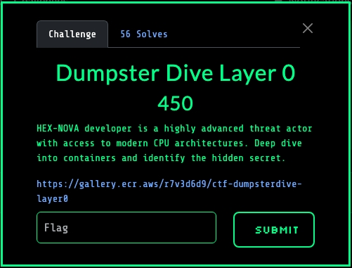
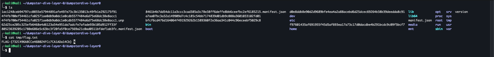

Our task is to retrieve the flag from a container published by H3XN0V4. A
screenshot of this challenge's description and hints are provided below:



## Solution

We inspect the manifest for the container in H3XN0V4's registry by invoking the
following:

```bash
sudo docker manifest inspect \
	public.ecr.aws/r7v3d6d9/ctf-dumpsterdive-layer0:latest
```

We receive the following response:

```json
{
  "schemaVersion": 2,
  "mediaType": "application/vnd.oci.image.index.v1+json",
  "manifests": [
    {
      "mediaType": "application/vnd.oci.image.manifest.v1+json",
      "size": 1232,
      "digest": "sha256:8461b4b7dd54dc11a3ccc3cad385a3c78e38ff6deffe8bb6ceefbc2ef6185215",
      "platform": { "architecture": "ppc64le", "os": "linux" }
    },
    {
      "mediaType": "application/vnd.oci.image.manifest.v1+json",
      "size": 566,
      "digest": "sha256:80523639205c1780e686e5c63bc3f20fa5f0ce7569a21c0ad0511bfdef1ab3fc",
      "platform": { "architecture": "unknown", "os": "unknown" }
    }
  ]
}
```

Using [skopeo](https://github.com/containers/skopeo), we download the container
image and its layers into a local directory for inspection by invoking the
following:

```bash
skopeo copy \
	docker://public.ecr.aws/r7v3d6d9/ctf-dumpsterdive-layer0:latest \
	dir:./dumpsterdive-layer0 \
	--multi-arch all
```

We inspect the file types of the downloaded content in the `dumpsterdive-layer0`
directory:

```bash
cd dumpsterdive-layer0 && file *

1ac1248ceb94797cc0855e57944891afe497e73c3b135013c49fb1e292175f91: JSON text data
4f4fb700ef54461cfa02571ae0db9a0dc1e0cdb5577484a6d75e68dc38e8acc1: gzip
compressed data, original size modulo 2^32 1024
62d25ce205c325efb6468e4d6123a54e951da7adcfe7afade93b105d912ff33f: gzip
compressed data, original size modulo 2^32 2048
80523639205c1780e686e5c63bc3f20fa5f0ce7569a21c0ad0511bfdef1ab3fc.manifest.json:
JSON text data
8461b4b7dd54dc11a3ccc3cad385a3c78e38ff6deffe8bb6ceefbc2ef6185215.manifest.json:
JSON text data a7aa07bc3a32a149909d7c4c185c54bb7174839d01db9c088a3601033102fd01:
JSON text data bfcf6cd476d164064f491929262b1589360f2e36aa341c044c96eceebf5029c8:
JSON text data d0e8ddb8e90d2d9689bfe4ea4a2a88acebd6d25dcec69264b38b39deedda8c91:
gzip compressed data, original size modulo 2^32 2560
f97601435af691955f45d5af693ea17a73c17d0dacdbe4b291bcdc9c09f5bcf7: gzip
compressed data, was
"5226ce49eeb58731f793d11b9be395c97a2b1db38e97fbf00dd2af63e570448d.tar", last
modified: Mon Jul 14 16:35:17 2025, max compression, original size modulo 2^32
120068096 manifest.json: JSON text data version: ASCII text
```

We expand all of the archives present in the `dumpsterdive-layer0` directory by
invoking the following:

```bash
unp *
```

This exposes the flag in the `tmp` directory, a screenshot is provided below:


