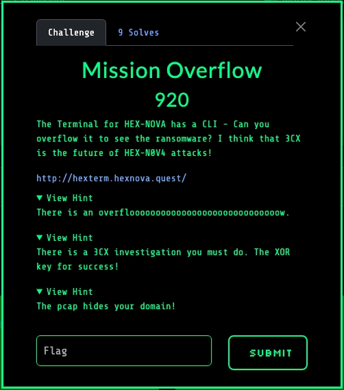
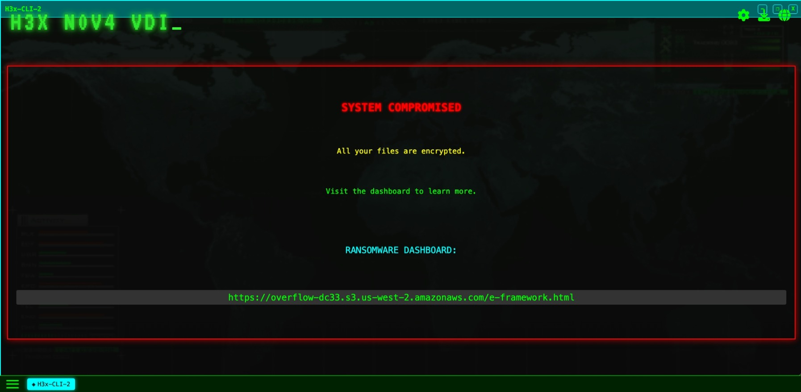
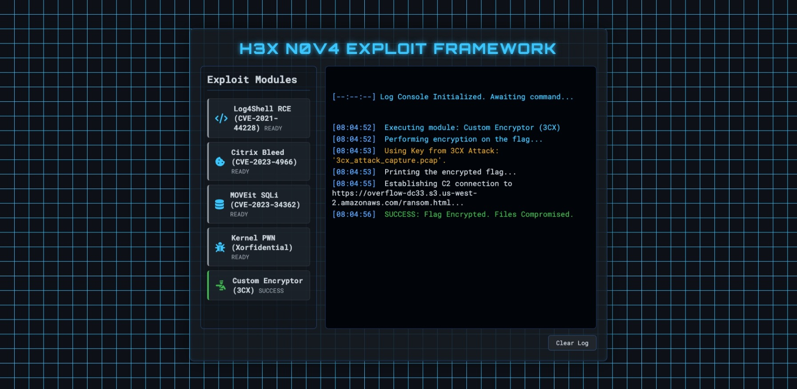
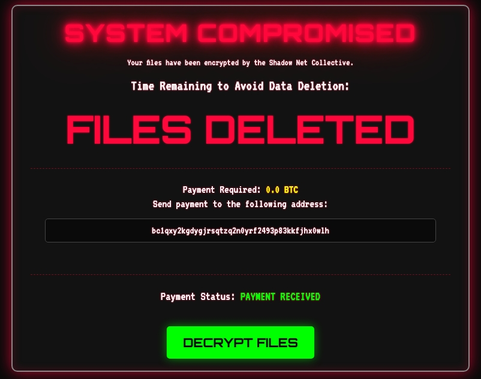
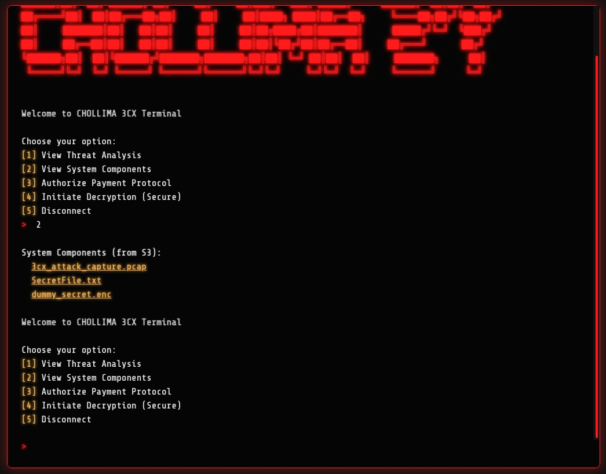
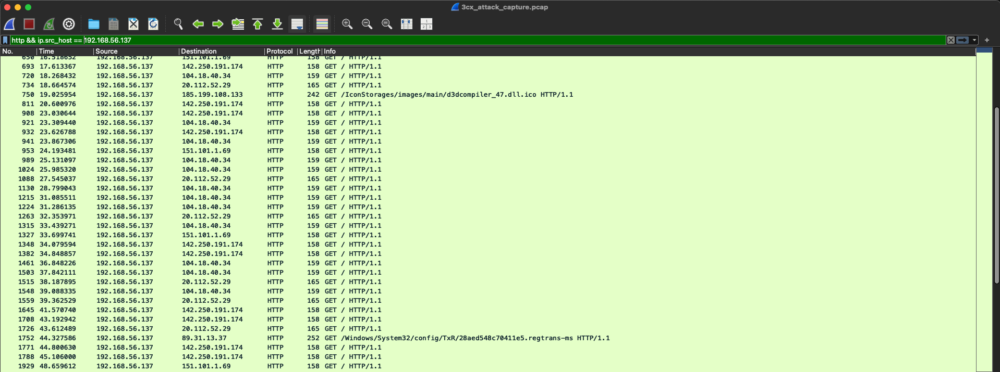
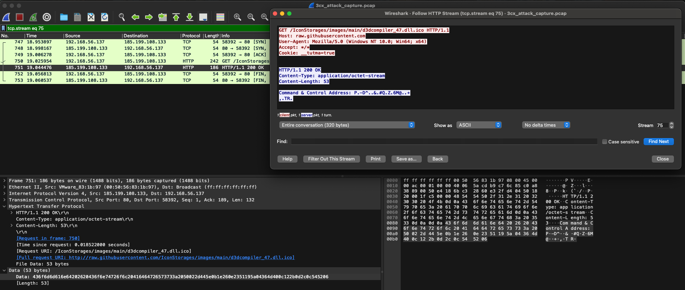
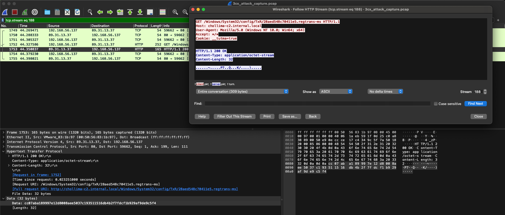
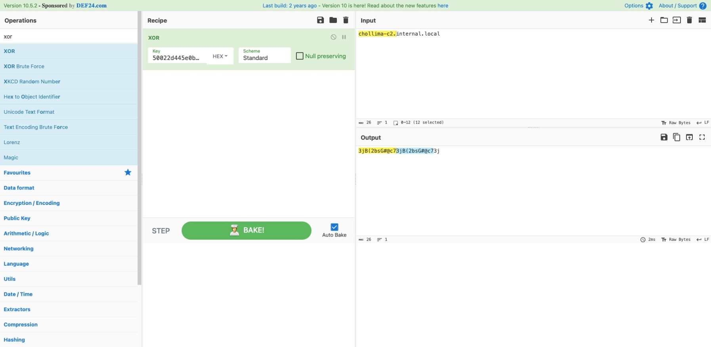
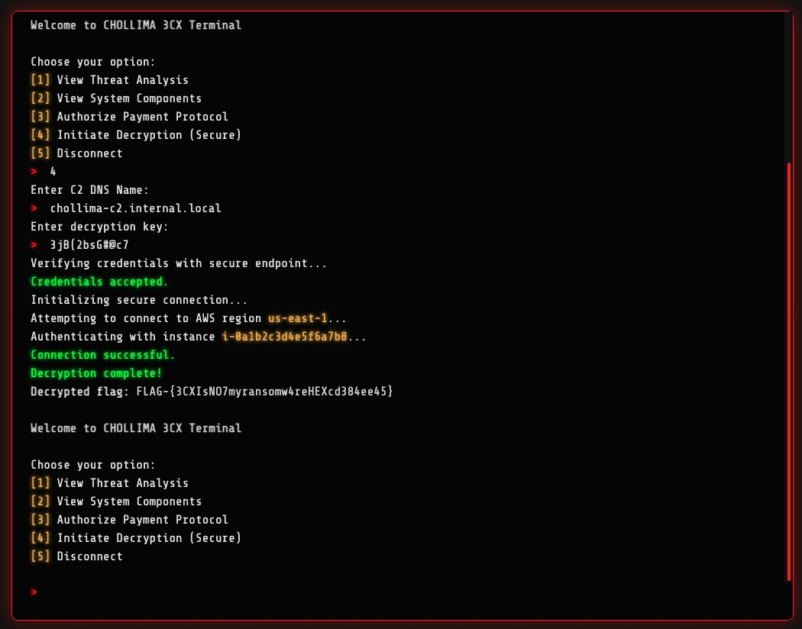

We're asked to conduct an investigation of the H3XN0V4 command and control (C2)
to discover the flag. A screenshot of this challenge's description and hints are
provided below:

## Enumeration

We inspect the H3XN0V4-VDI command line interface (CLI) and access the H3x-CLI
application. We are greeted with a CLI. If we hold down a key for long enough,
we trigger a buffer overflow, causing the CLI to crash. We are redirected to the
H3XN0V4 exploit framework page. A screenshot is provided below:

Visiting the exploit framework page, we click the custom encryptor application
and are provided with a link to the ransom page. A screenshot is provided below:

Visiting the ransom page, we wait for a while until the "DECRYPT FILES" button
appears. A screenshot is provided below:

Clicking the "DECRYPT FILES" button redirects us to the Chollima 3CX terminal.
Using the second CLI option, we're greeted with download links for some
artifacts, notably a `.pcap` packet capture file. A screenshot is provided
below:

## Network traffic forensics

We inspect the `3cx_attack_capture.pcap` packet capture file in
[Wireshark](https://www.wireshark.org/), looking for all HTTP traffic outbound
from the compromised host. A screenshot of our filtering is provided below:

We notice outbound communications to what looks like a C2 server. We inspect the
first HTTP request and response and notice that the response contains the C2
server's address, however, it seems to be XOR encoded:

The second outbound communication is to the C2 server, with the address present
in plaintext:

We notice that the C2 server's hostname, `chollima-c2.internal.local`, is 26
characters long and the XOR encoded response from earlier,
`50022d445e0b1e260e2351195a04364d400c122b0d2c0c545206`, is 52 characters long.
With this is mind, we use CyberChef to XOR `chollima-c2.internal.local` with the
encoded response to retrieve the original XOR key:

## Solution

We revisit the Chollima 3CX terminal and provide the C2 hostname and XOR key to
retrieve the flag:

